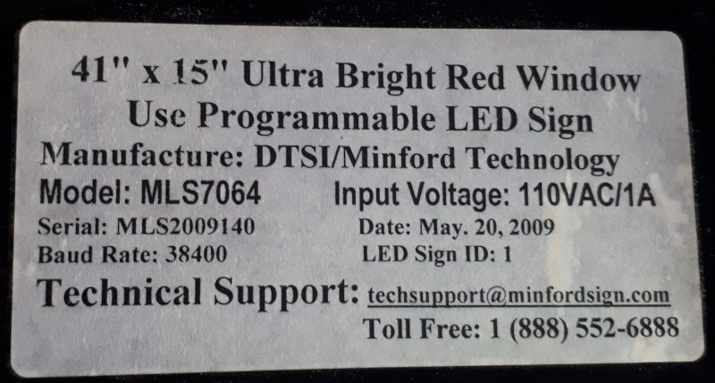
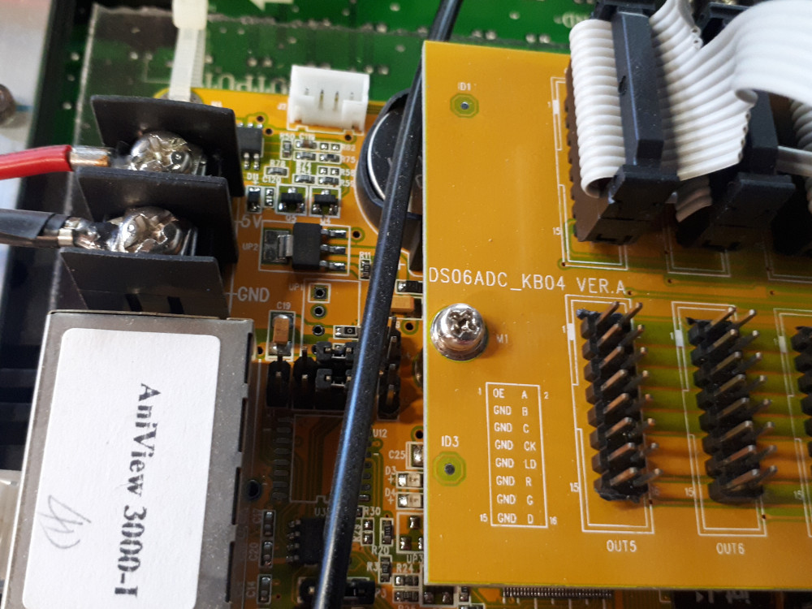
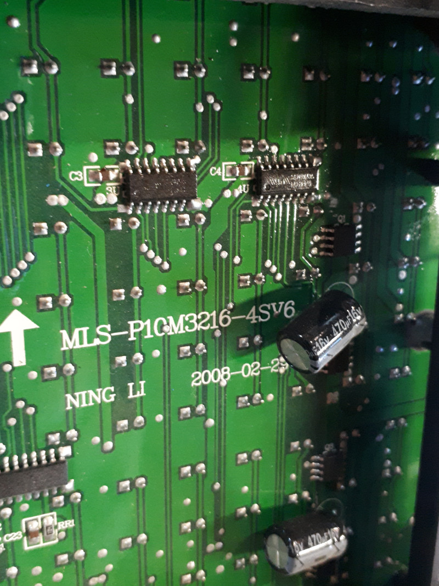

# AniView-comms

An attempt at interfacing with the [AniView 3000-1](http://www.lumenchina.com/page-164-146-j0xril.html) display that Hive13
acquired.

Link to LedCenter is seemingly down, but [Wayback Machine remembers](https://web.archive.org/web/20140721122039/http://www.2008led.com/en/displayproduct.html?proTypeID=153414&proID=2456571).

## Original wiring

This originally had the bottom board's "Input" port connected to a WeMo D1 mini.

Looking at the "Input" port on the board (yes, I made up this numbering myself):

```
 -------------------------
|  1  3  5  7  9 11 13 15 |
|  2  4  6  8 10 12 14 16 |
 -----------    ----------
```

Input pins connect to WeMo D1 mini pins like this:
 - 1 - D1
 - 2 - D2
 - 3 - D0
 - 4 - G
 - 5 - D4
 - 7 - D3
 - 11 - D6
 - 15 - D5

## Attempts at finding specs/docs/anything

Above page calls for "LedCenter V3.00 or above" - download page there with executables for windows and android at least: http://www.lumenchina.com/en-download/

So far, this repository is just a dump of notes and photos I've been taking.

As the daughterboard has the identifier `DS06ADC_KB04 VER.A` on it, I
am guessing it is the KB04 referred to in that link, which gives this
pinout:

```
 -------------------------
|  A  B  C CK LD  R  G  D |
| OE  N  N  N  N  N  N  N |
 -------------------------
```

The "plug board CAM" link is down, but [Wayback Machine remembers](https://web.archive.org/web/20161224033255/http://www.lumenchina.com/page-164-146-j0xril.html): [KB04.rar](https://web.archive.org/web/20161224033255/http://www.2008led.com/front/action/file/downloadAction.do?id=4324).

That RAR, and the RAR inside it (?), are extracted into the
`board_cam` directory in this repo.

For the mainboards, I am finding seemingly no reference to the PCBs
online, except for [this spreadsheet on Baidu](https://wenku.baidu.com/view/458d32efe009581b6bd9ebd5) that looks kind of useless.

## Photos



To make this more easily searchable:

```
41" by 15" Ultra Bright Red Window
Use Programmable LED Sign
Manufacture: DTSI/Minford Technology
Model: MLS7064
Serial: MLS2009140
Baud Rate: 38400
Input Voltage: 110VAC/1A
Date: May. 20, 2009
LED Sign ID: 1
Technical Support: techsupport@minfordsign.com
Toll Free: 1 (888) 552-6888
```



```
DS06ADC_KB04 VER.A
```



```
MLS-P10M3216-4SV6
NING LI
2008-02-29
```
